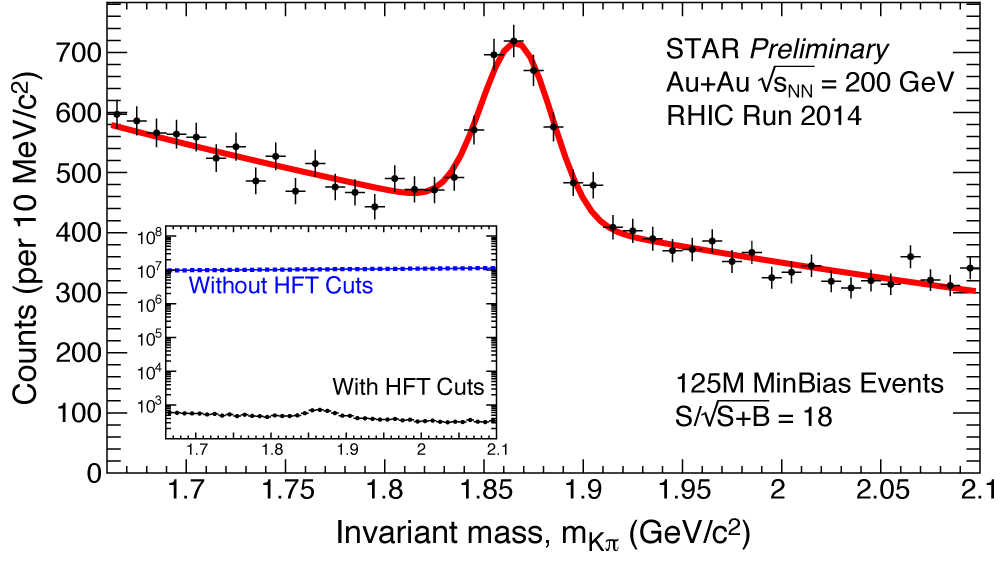

##D<sup>0</sup> Spectra and Nuclear Modification Factor Analysis
LBNL - STAR Experiment, Relativistic Heavy Ion Collider (RHIC), BNL  
RHIC year 2014 Run, with Heavy Flavor Tracker
  
###Code Authors:  
[Guannan Xie](http://github.com/GuannanXie) - guannanxie@lbl.gov  
[Mustafa Mustafa](http://github.com/MustafaMustafa)  - mmustafa@lbl.gov  

- - -
### Pico production monitors:
[Pico production monitor](http://portal.nersc.gov/project/star/mustafa/picoProductionMonitor/)  
[Pico D<sup>0</sup> production monitor](http://www.star.bnl.gov/protected/heavy/mstftsm/run14/picoD0ProductionMonitor/)  
- - -
### Presentations:  
#### STAR Protected:  
1. [Introduction to data production and pipeline I](http://www.star.bnl.gov/protected/heavy/mstftsm/run14/talks/2015-04-02.pdf), Mustafa, HF PWG, 2015-04-02  
2. [D<sup>0</sup> Production for Run14 AuAu200 GeV](https://drupal.star.bnl.gov/STAR/system/files/2015May14_Run14_200GeV_D0_HF.pdf), Guannan, HF PWG, 2015-05-14  
3. [D<sup>0</sup> Analysis Status](https://drupal.star.bnl.gov/STAR/system/files/2015May18_Run14_200GeV_D0_SoftHadron.pdf), Guannan, Soft Hadron, 2015-05-18  
4. [Pico Heavy Flavor Analysis Library](https://drupal.star.bnl.gov/STAR/system/files/2016-06-01-Jochen-Mustafa_0.pdf), Mustafa, HF PWG, 2015-06-01  
5. [D<sup>0</sup> Reconstruction in Run14 Au+Au 200 GeV](https://drupal.star.bnl.gov/STAR/system/files/2015June2_Run14_200GeV_D0_STARCollMeeting.pdf), Guannan, STAR Collaboration Meeting, 2015-06-02  
6. [KF vs. Minuit vertex impact on D<sup>0</sup> reconstruction](https://drupal.star.bnl.gov/STAR/system/files/2015June12_Run14_200GeV_D0_Kf.pdf), Guannan, HF PWG, 2015-06-11  
7. [D<sup>0</sup> Production and R_cp correction](http://www.star.bnl.gov/protected/heavy/mstftsm/run14/talks/2015-06-11-HF-PWG.pdf), Mustafa, HF PWG, 2015-06-11  
8. [D<sup>0</sup> R_cp correction](http://rnc.lbl.gov/~xdong/SoftHadron/presentations/20150615/2015-06-15-Soft-Hadron.pdf), Mustafa, Soft Hadron, 2015-06-15  
9. [D<sup>0</sup> NMF extraction](http://www.star.bnl.gov/protected/heavy/mstftsm/run14/talks/2015-06-18-PWG.pdf), Mustafa, HF PWG, 2015-06-18
10. [D<sup>0</sup> Bump - Forgeround Cocktail](http://rnc.lbl.gov/~xdong/SoftHadron/presentations/20150622/2015-06-22-Soft-Hadron.pdf), Mustafa, Soft Hadron, 2015-06-22  
11. [Pico Mixed Event Maker, D<sup>0</sup> Case Study](http://rnc.lbl.gov/~xdong/SoftHadron/presentations/20150622/SofHadron_2015-06-22.pdf), Michael, Soft Hadron, 2015-06-22  
12. [D0 input distributions for data-driven simulation](https://drupal.star.bnl.gov/STAR/system/files/2015July13_Run14_HFTRatio_Phi_and_Statistics_MixedEvent.pdf), Guannan, Soft Hadron, 2015-07-13  
13. [Fast Simulator distributions/ Event Mixing](https://drupal.star.bnl.gov/STAR/system/files/2015July16_Run14_HFTRatio_Phi_and_Statistics_MixedEvent.pdf), Guannan, HF PWG, 2015-07-16  
14. [Pico Mixed Event Maker](http://www.star.bnl.gov/protected/heavy/mlomnitz/PicoMixedEvent/PicoMixedEvent.pdf), Michael, HF PWG, 2015-07-16  
15. [D<sup>0</sup> Bump](http://www.star.bnl.gov/protected/heavy/mstftsm/run14/talks/2015-06-22-Soft-Hadron.pdf), Mustafa, HF PWG, 2015-07-16  
16. [Vertex resolution studies with KFVertex and Minuit Vertex ](http://drupal.star.bnl.gov/STAR/system/files/2015July22_VtxResolution.pdf), Guannan, HF PWG, 2015-07-23  
17. [D<sup>0</sup> Tree with KFVertex](https://drupal.star.bnl.gov/STAR/system/files/2015July22_KfD0Tree_FinalCheck.pdf), Guannan, HF PWG, 2015-07-23  
18. [Vertex resolution studies with KFVertex and Minuit Vertex (update) ](https://drupal.star.bnl.gov/STAR/system/files/2015July27_VtxResolution_nTracks_Tof.pdf), Guannan, 2015-07-27  
19. [Secondary Track Dca contribution study](https://drupal.star.bnl.gov/STAR/system/files/2015Aug9_SeconaryTrack_Dca.pdf), Guannan, 2015-08-11  
20. [D<sup>0</sup> Production for Run14 AuAu200 GeV HF workshop](https://drupal.star.bnl.gov/STAR/system/files/2015Aug20HFTWorkShop.pdf), Guannan, LBL HF Workshop, 2015-08-20 
21. [PID Efficiency and Double Counting](http://www.star.bnl.gov/protected/heavy/dongx/presentation/HFPWG_PID_09032015.pdf), Xin, HF PWG, 2015-09-03
22. [Data Driven Fast Simulator QA](https://drupal.star.bnl.gov/STAR/blog/mstftsm/data-driven-fast-simulator-qa-checklist), Mustafa, HF PWG, 2015-09-04
23. [D<sup>0</sup> Production for Run14 AuAu200 GeV short summary](https://drupal.star.bnl.gov/STAR/system/files/2015Sep10_HFPWG.pdf), Guannan, HF PWG, 2015-09-10  
24. [K<sub>s</sub> spectra with HFT](https://drupal.star.bnl.gov/STAR/system/files/userfiles/131/HFPWG_KsSpectra_09102015.pdf), Xin, HF PWG, 2015-09-10  
25. [Data Driven Fast Simulator - D<sup>0</sup>](http://www.star.bnl.gov/protected/heavy/mstftsm/run14/talks/2015-09-10-Mustafa-Xin.pdf), Mustafa, HF PWG, 2015-09-11
26. [K<sub>s</sub> Spectra. D<sup>0</sup> double counting](http://www.star.bnl.gov/protected/heavy/dongx/presentation/HFPWG_Ks_PID_09172015.pdf), Xin, HF PWG, 2015-09-17
27. [D<sup>0</sup> Systematic Error Study short summary](https://drupal.star.bnl.gov/STAR/system/files/2015Sep27_PWG_D0SystematicErrStudy.pdf), Guannan, HF PWG, 2015-09-27  
28. [Systematics of Ultimate Cuts II - Using Fast Sim](http://www.star.bnl.gov/protected/heavy/mstftsm/run14/talks/2015-09-27-PWG.pdf), Mustafa, HF PWG, 2015-09-27  
29. [R_AA of D<sup>0</sup> Meson in Au+Au Collisions at 200GeV](https://drupal.star.bnl.gov/STAR/files/GuannanX_DMesonQM15_V0.11_0.pdf), Guannan, QM15, 2015-10-28  
30. [D<sup>0</sup> Spectra - Corrections Crosschecks](https://drupal.star.bnl.gov/STAR/system/files/2016Mar31_PWG_D0_status.pdf), Guannan, HF PWG, 2016-03-31
31. [D<sup>0</sup> Production in Run14 P16id](http://www.star.bnl.gov/protected/heavy/mstftsm/run14/P16idTest/2016-05-04.pdf), Mustafa, HF PWG, 2016-05-05

- - -
### Preliminary results:


- - -
###How to build this code:  
```bash
mkdir myAnalysis
cd myAnalysis

# Replace address below with your own fork if you have one
git clone git@github.com:MustafaMustafa/auau200GeVRun14Ana.git

# Clone LBNL PicoHFLib
git clone git@github.com:rnc-lbl/auau200GeVRun14.git

# Now you need to get StPicoDstMaker
# If compiling at PDSF you need to get a klog token as below.
# - You don't need this step at RCF - 
# You will need to enter your RCF password.
klog -principal YOURRCFUSERNAME
cvs co -r Run14_AuAu200_physics2 offline/users/dongx/pico/source/StPicoDstMaker

# Clone StRefMultCorr
git clone git@github.com:GuannanXie/Run14AuAu200GeV_StRefMultCorr.git

# Link all needed code under one StRoot directory:
mkdir StRoot
ln -s `pwd`/auau200GeVRun14Ana/StRoot/StPicoD0AnaMaker StRoot
ln -s `pwd`/auau200GeVRun14/StRoot/StPicoD0EventMaker StRoot
ln -s `pwd`/auau200GeVRun14/StRoot/StPicoPrescales StRoot
ln -s `pwd`/offline/users/dongx/pico/source/StPicoDstMaker StRoot
ln -s `pwd`/Run14AuAu200GeV_StRefMultCorr/VPDMB5/StRefMultCorr StRoot
ln -s `pwd`/auau200GeVRun14/StRoot/StPicoKFVertexFitter StRoot
cp -r -p auau200GeVRun14/run14AuAu200GeVPrescales/ .

# Compile
starver SL15c
cons
```

###How to get a list of files:  
```bash
# Clone the file list repo:
git clone git@github.com:rnc-lbl/fileLists.git

# The list of daily D0 production will be under:
ls fileLists/Run14/AuAu/200GeV/physics2/picoD0Lists/daily

# To update your local copy of the list of files (recommended to do daily):
git pull origin master
```

###How to run this code:  
```bash
# For testing we can run the code on one file:
tail -n1 fileLists/Run14/AuAu/200GeV/physics2/picoD0Lists/daily/picoD0List_2015-05-21.list > test.list
ln -s `pwd`/auau200GeVRun14Ana/StRoot/macros/runPicoD0AnaMaker.C
root4star -l -b -q -x runPicoD0AnaMaker.C\(\"test.list\",\"test_out\"\)
```

###How to submit jobs:
```bash
# You cah find STAR Scheduler XML file under:
cp -p auau200GeVRun14/starSubmit/submitPicoD0AnaMaker.xml .
# auau200GeVRun14/starSubmit/uREADME contains a how to use.
```
